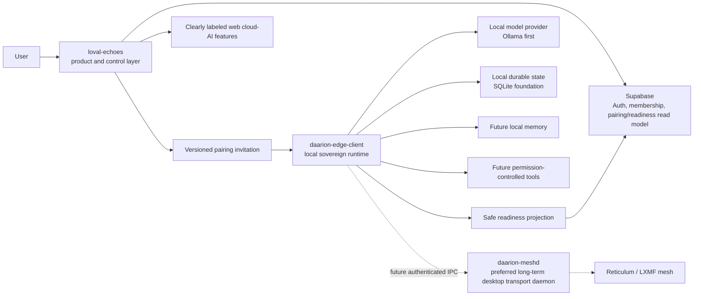

# System Context and Ownership

Status: **CANONICAL OWNERSHIP BASELINE**

## Context

Arrows show intended data/control relationships, not current implementation proof.

## Canonical ownership matrix

| Capability or truth | Canonical owner | Reader/consumer | Rule |
| --- | --- | --- | --- |
| Product account/session | `loval-echoes` + Supabase Auth | Web product | Never substitutes for local cryptographic identity |
| MicroDAO membership | Supabase product contract | Web UI and invitation RPC | Must be authenticated and RLS/grant constrained |
| Community invitation | `loval-echoes` | Human onboarding | Never reused as device-pairing authorization |
| Device pairing invitation UI | `loval-echoes` | User | Displays/relays authoritative payload; does not mint authority client-side |
| Device pairing consumption | `daarion-edge-client` | Local runtime | Must verify signature, purpose, binding, expiry, replay and revocation |
| Local pairing state | `daarion-edge-client` | Edge services | Private device state; web receives only safe status |
| Device root identity | `daarion-edge-client` + OS secure storage | Edge policy/signing services | Private key never leaves secure boundary |
| Agent identity | `daarion-edge-client` | Supervisor/transport contracts | Separate security domain from device, wallet and transport |
| Local model lifecycle | `daarion-edge-client` | Edge UI/Supervisor | No web-side execution or silent remote fallback |
| Edge execution policy | Deterministic Edge core | Provider, tools, loops | LLM cannot modify or bypass |
| Runtime state/checkpoints | `daarion-edge-client` SQLite | Edge services | Never synchronized raw to the web |
| Local memory | `daarion-edge-client` | Context builder under policy | Raw memory remains local by default |
| Tool permission decision | `daarion-edge-client` policy broker | Tool executor/UI approval | Model output is only a proposal |
| Wallet signing | Future isolated Edge signer | User-approved transaction path | No direct LLM or browser signing authority |
| Readiness projection | `daarion-edge-client` producer | Supabase/web display | Minimal, versioned, signed, fresh and revocable |
| Mesh transport/mailbox | Future `daarion-meshd` | Edge transport adapter | No policy, memory or signing ownership |
| Web cloud AI | `loval-echoes` cloud feature boundary | Explicit web feature | Clearly labeled and not represented as local Edge capability |
| Live infrastructure truth | Private operations systems | Authorized operators only | Never copied into public repositories |

## Writer rules

To avoid split-brain systems, each truth has one authoritative writer:

- architecture truth: reviewed architecture/ADRs;
- product membership truth: authenticated backend contract;
- local runtime/task truth: Edge runtime store;
- identity truth: domain-specific cryptographic store;
- readiness truth: signed Edge projection plus server freshness policy;
- routing truth: selected transport layer, not UI or model;
- wallet truth: isolated signer/chain state;
- evidence/audit truth: append-only event store with controlled exports.

UI caches, README text, module names, prompts, compose files, current node placement, and model output are not canonical writers.

## Cross-repository contract rules

1. Every privileged schema is versioned and has producer/consumer fixtures.
2. The consumer validates all fields and rejects unknown/expired/unsupported versions according to contract.
3. Authentication, authorization, signature validation, freshness, replay, revocation and idempotency are separate checks.
4. Browser-supplied user IDs, URLs, labels and status are untrusted.
5. Safe projections expose the minimum data required by product UX.
6. Contract changes require both repository owners, migration/rollback analysis, security review, and separate ADRs where trust anchors differ.
7. Pairing and readiness projections require separate ADRs because they have different producers, lifetimes, replay semantics, and revocation behavior.

## What must not be shared

- private keys, mnemonics or signing handles;
- raw prompts, conversations, memories, embeddings or tool results;
- unrestricted commands, paths, environment variables or process handles;
- transport mailbox contents or routing topology;
- private infrastructure, endpoints, access policy or operational evidence;
- wallet signing authority;
- worker leases or sandbox internals unless a narrowly versioned contract requires a safe summary.

## Current boundary verdict

The ownership split is viable and is an architectural strength. The contracts are not yet security-complete. Production pairing, readiness attestation, tools, transport, wallet, worker and autonomous loops remain blocked by [SECURITY_GATES.md](../security/SECURITY_GATES.md).
